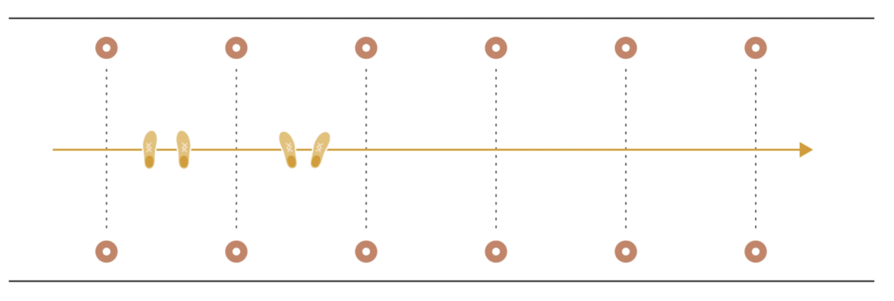
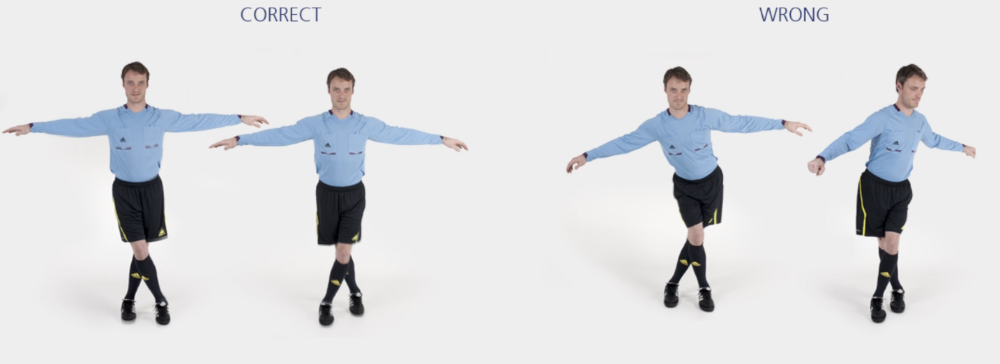

# 助理裁判员 &ndash; 交叉步

沿场地线侧向交叉步至最后一个标志筒，沿场地外侧慢跑返回。

**改变身体朝向，重复上述练习。**

**⚠️ 注意事项**

- 保持骨盆水平、核心稳定；
- 双臂平举，与场地线平行；
- 膝盖微曲，将身体重心置于前脚掌。

>❗️ 切忌膝盖内扣。

## ➿ 跑动路线

## 🎬 动作示范

    <video controls>
        <source src="../videos/part1/cariocas.mp4" type="video/mp4">
    </video>

