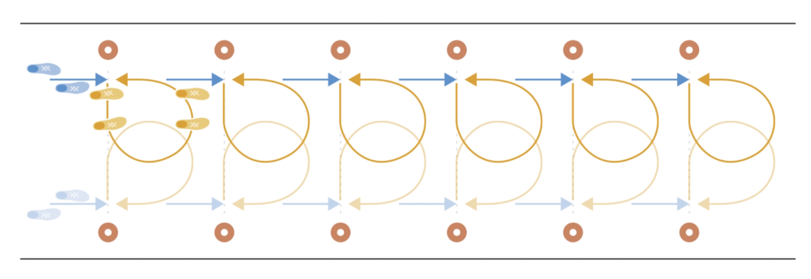

# 双人绕圈跑

两名裁判员同时出发，慢跑至下一个标志筒；横向侧滑步至与同伴相遇，围绕同伴侧滑步一圈（期间不改变身体朝向），然后继续侧滑步返回本方标志筒。慢跑至下一个标志筒并重复上述练习。经过所有标志筒后，沿场地外侧慢跑返回。

✌️ 本练习需完成**两次**。

**⚠️ 注意事项**

- 臀部、膝盖略微弯曲，将身体重心置于前脚掌；
- 上半身保持挺直。

>❗️ 切忌膝盖内扣。

## ➿ 跑动路线

## 🎬 动作示范

    <video controls>
        <source src="../videos/part1/circling.mp4" type="video/mp4">
    </video>

