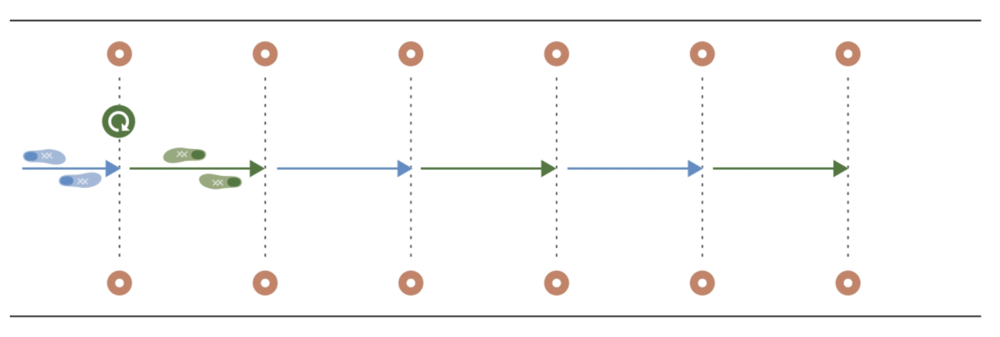
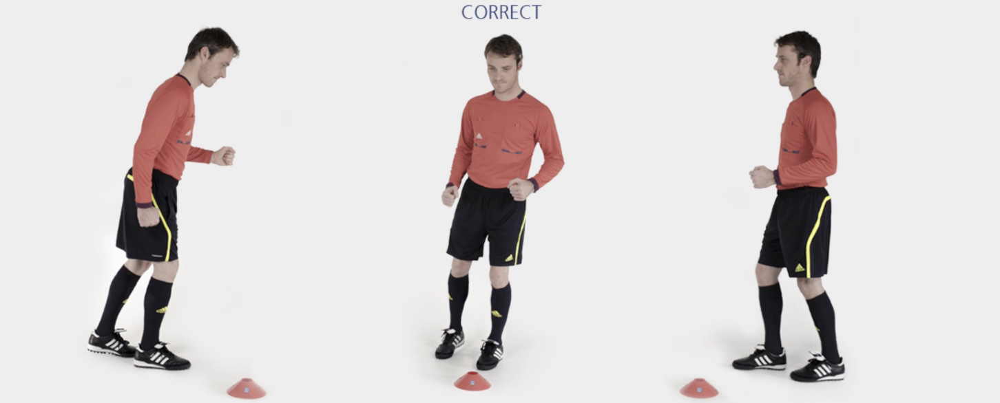

# 主裁 &ndash; 连续转身跑

出发慢跑至下一个标志筒，减速并转身 180 度；向后慢跑至下一个标志筒，转身 180 度。重复上述练习。

经过所有标志筒后，沿场地外侧慢跑返回。

✌️ 本练习需完成**两次**。

**⚠️ 注意事项**

- 上半身保持挺直；
- 臀部、膝盖和脚保持一直线；
- 转身时动作保持流畅。

>❗️ 切忌膝盖内扣。

## ➿ 跑动路线

## 🎬 动作示范

    <video controls>
        <source src="../videos/part1/rotations.mp4" type="video/mp4">
    </video>

