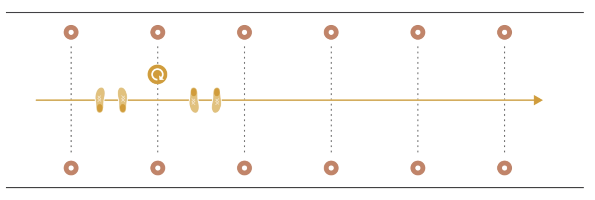
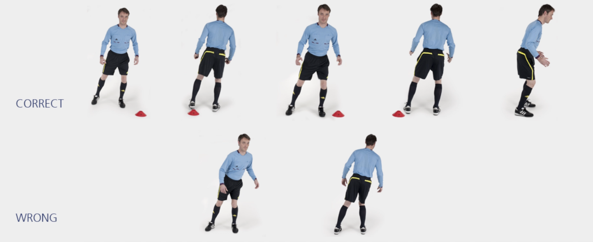

# 助理裁判员 &ndash; 左右侧滑步交替

沿场地线侧向滑步，每到一个标志筒改变滑步方向，直至最后一个标志筒。经过所有标志筒后，沿场地外侧慢跑返回。

✌️ 本练习需完成**两次**。

**⚠️ 注意事项**

- 臀部、膝盖略微弯曲，将身体重心置于前脚掌；
- 转身时动作保持流畅；
- 上半身保持挺直。

>❗️ 切忌膝盖内扣。

## ➿ 跑动路线

## 🎬 动作示范

    <video controls>
        <source src="../videos/part1/shuffling.mp4" type="video/mp4">
    </video>

