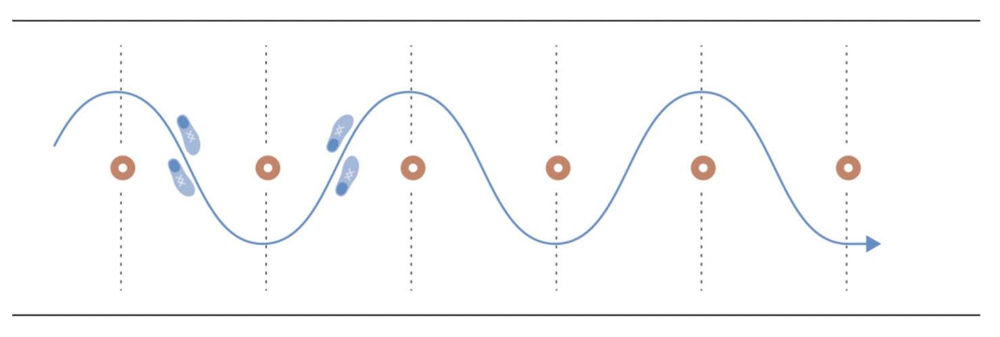
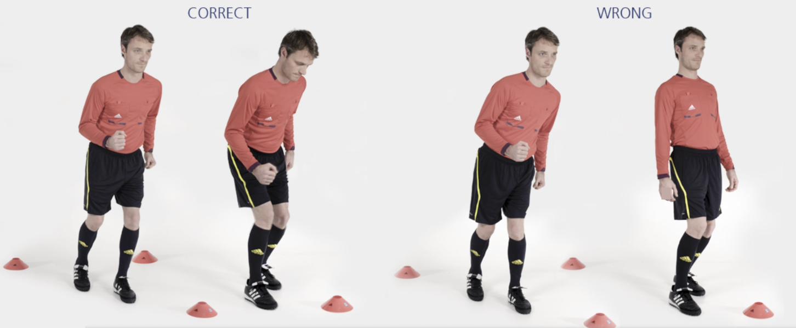

# 主裁 &ndash; S 形障碍跑

向前 S 形慢跑至最后一个标志筒，沿场地外侧慢跑返回。

接着，向后 S 形慢跑至最后一个标志筒，沿场地外侧慢跑返回。

**⚠️ 注意事项**

- 上半身保持挺直；
- 臀部、膝盖和脚保持一直线。

>❗️ 切忌膝盖内扣。

## ➿ 跑动路线

## 🎬 动作示范

    <video controls>
        <source src="../videos/part1/slalom.mp4" type="video/mp4">
    </video>

