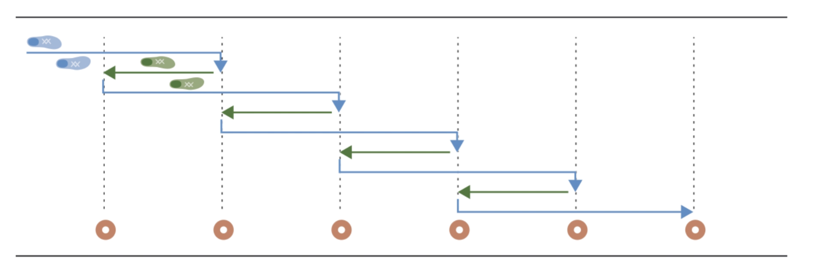
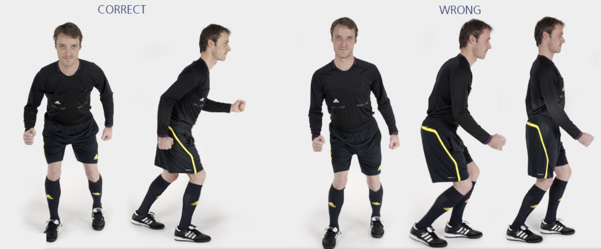

# 快速跑

快速向前跑两个标志筒，快速后退跑一个标志筒。臀部、膝盖略微弯曲。

重复上述练习——前进两个标志筒、后退一个标志筒。经过所有标志筒后，沿场地外侧慢跑返回。

✌️ 本练习需完成**两次**。

**⚠️ 注意事项**

- 上半身保持挺直；
- 臀部、膝盖和脚保持一直线。

>❗️ 切忌膝盖内扣。

## ➿ 跑动路线

## 🎬 动作示范

    <video controls>
        <source src="../videos/part1/sprints.mp4" type="video/mp4">
    </video>

