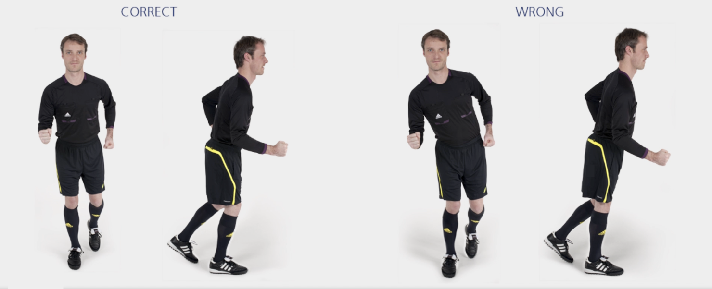

# 直线跑

沿场地内侧直接慢跑至最后一个标志筒。沿外侧返回时稍稍提速。

✌️ 本练习需完成**两次**。

**⚠️ 注意事项**

- 上半身保持挺直；
- 臀部、膝盖和脚保持一直线。

>❗️ 切忌膝盖内扣。

## ➿ 跑动路线

## 🎬 动作示范

    <video controls>
        <source src="../videos/part1/straight.mp4" type="video/mp4">
    </video>

