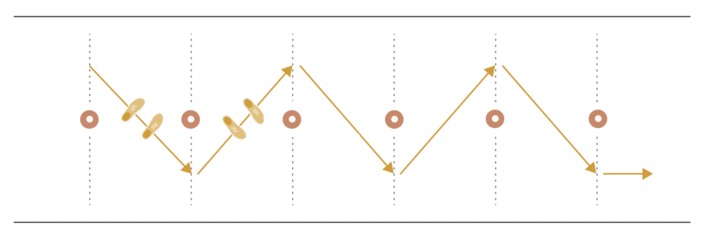
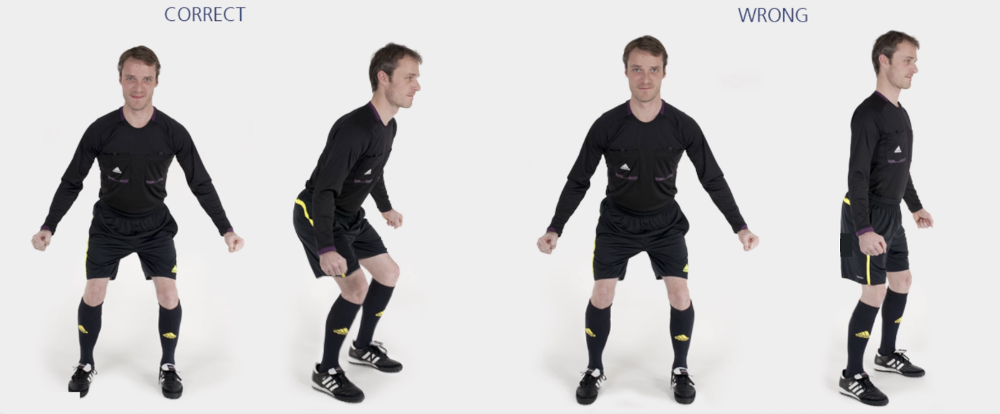

# Z 字侧滑步

沿 Z 字形侧滑步经过所有标志筒；每到一个标志筒改变滑步方向；保持跑动直至最后一个标志筒。

✌️ 本练习需完成**两次**。

**⚠️ 注意事项**

- 保持背部挺直，上半身前倾；
- 臀部、膝盖略微弯曲，将身体重心置于前脚掌；
- 改变滑步方向时动作保持流畅。

>❗️ 切忌膝盖内扣。

## ➿ 跑动路线

## 🎬 动作示范

    <video controls>
        <source src="../videos/part1/zigzag.mp4" type="video/mp4">
    </video>

