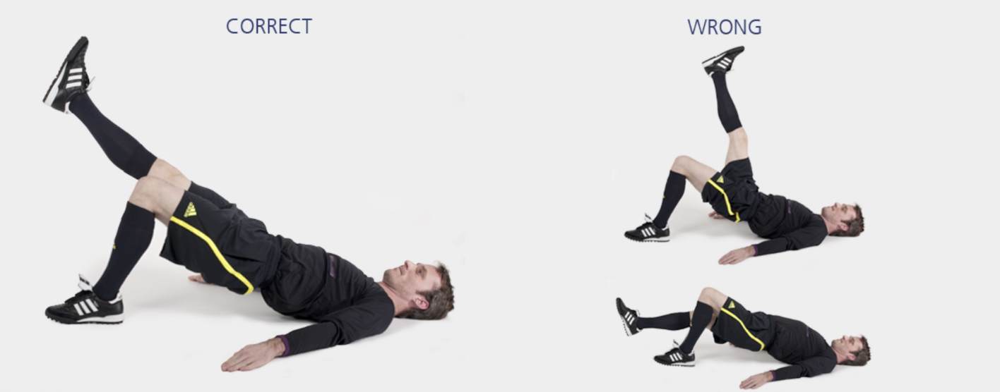

# 臀桥

本练习旨在增强**背部与臀部**肌群，对保持身体在各类活动中的稳定性至关重要。

**起始动作：** 仰卧，膝关节弯曲成90°，双脚平放于地面。

**练习动作：** 双脚着地，骨盆上提至身体成一直线。收紧腹部和臀部肌肉。两腿交替抬起并伸直，每次保持 **1–2** 秒，共持续 **20–30** 秒。完成后返回起始动作。

**次数：** 1 组（ 20–30 秒）

**⚠️ 注意事项**

- 抬起骨盆后，保持身体成一直线；
- 骨盆保持稳定，不可倾斜；
- 支撑脚位于膝盖下方。

>❌ 摇晃或拱起背部

## 🎬 动作示范

    <video controls>
        <source src="../../videos/part2/level1/bridge.mp4" type="video/mp4">
    </video>

