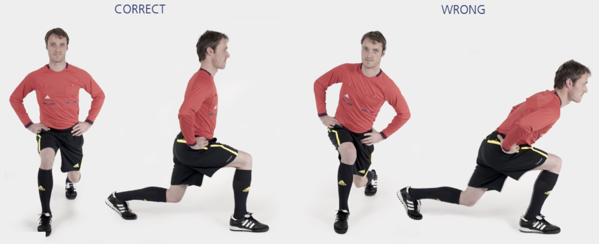

# 主裁 &ndash; 前弓步

本练习旨在锻炼**大腿后侧**肌群和**臀部**肌群，同时增强**身体控制**。

**起始动作：** 双脚站立，与肩同宽，双手置于腰间。

**练习动作：** 开始弓步时，缓慢弯曲臀部和膝盖，直到前膝弯曲 **90** 度。前侧的膝盖位置不可超出脚趾。保持上半身挺直、骨盆水平。然后回到起始位置，换另一条腿向前弓步。

**次数：** 1 组（每侧 10 次）

**⚠️ 注意事项**

- 前侧膝盖应弯曲至 90 度；
- 上半身保持挺直；
- 骨盆保持稳定；
- 前侧的膝盖位置不可超出脚趾。

>❌ 膝盖内扣
>
>❌ 上半身向前弯曲
>
>❌ 扭转或倾斜骨盆

## 🎬 动作示范

    <video controls>
        <source src="../../videos/part2/level1/front.mp4" type="video/mp4">
    </video>

