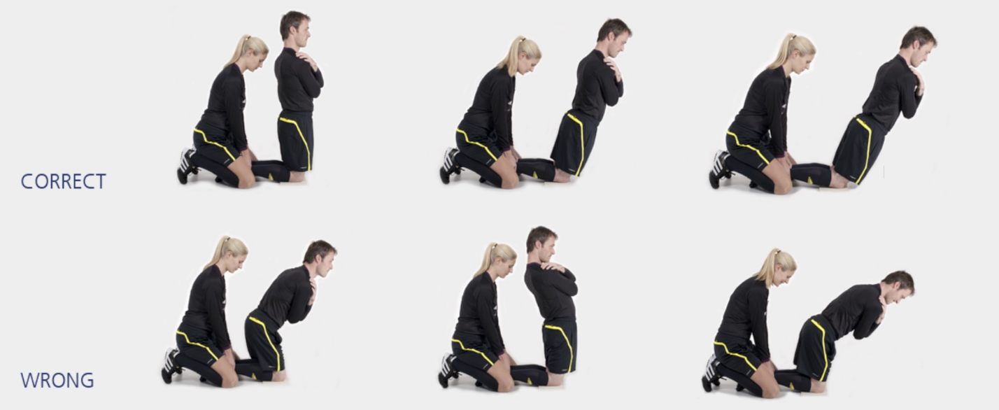

# 腘绳肌练习

本练习旨在增强**大腿后侧**肌群。

**起始动作：** 双膝与臀部同宽，跪在柔软的表面上；双臂交叉置于胸前。同伴跪在裁判员身后，双手抓住其脚踝上方，用身体重量将小腿压在地面上。

**练习动作：** 身体从头部到膝盖始终成一直线；缓缓向前倾斜，利用大腿后侧肌肉（腘绳肌）力量尽可能保持这一姿势。当无法再保持该姿势时，双手伸向地面进行缓冲，呈俯卧撑姿势。

**次数：** 1 组（ 7–10 次）

**⚠️ 注意事项**

- 同伴需将裁判员的小腿牢牢压向地面；
- 裁判员的头、上身和大腿应成一直线；
- 倾斜过程中只有膝关节可以活动；
- 刚开始时应缓慢进行此练习；一旦适应了该动作，就可以加快练习速度。

>❌ 头部后仰
>
>❌ 弯曲臀部

## 🎬 动作示范

    <video controls>
        <source src="../../videos/part2/level1/hamstrings.mp4" type="video/mp4">
    </video>

