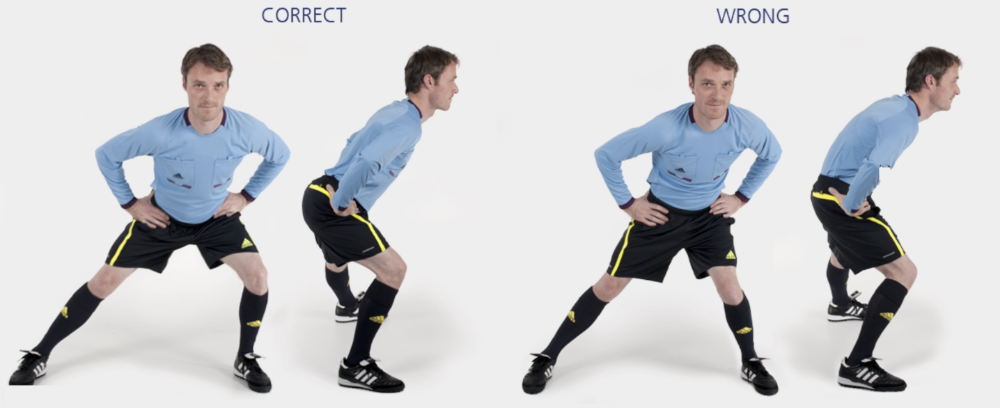

# 助理裁判员 &ndash; 45° 侧弓步

本练习旨在锻炼**髋部**和**臀部**肌群，同时增强**身体控制**。

**起始动作：** 双脚站立，与肩同宽，双手置于腰间。

**练习动作：** 缓慢向侧面弓步。开始弓步时，缓慢弯曲臀部和膝盖，直到支撑侧的膝盖弯曲约 **45** 度。保持该姿势 **1-2** 秒，然后回到起始位置。向另一侧进行弓步。每一侧弓步 **10** 次。

**次数：** 1 组（每侧 10 次）

**⚠️ 注意事项**

- 支撑侧膝盖应弯曲至 45 度;
- 上半身保持挺直;
- 骨盆保持水平。

>❌ 膝盖内扣
>
>❌ 上半身向前弯曲
>
>❌ 扭转或倾斜骨盆

## 🎬 动作示范

    <video controls>
        <source src="../../videos/part2/level1/lateral.mp4" type="video/mp4">
    </video>

