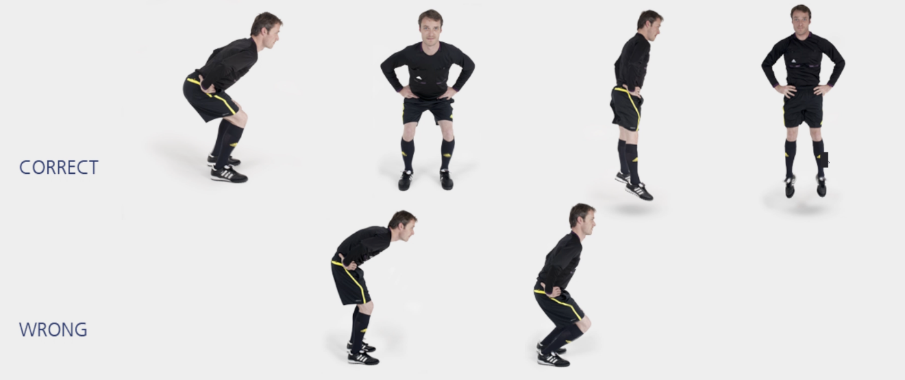

# 深蹲跳

本练习旨在增强**跳跃能力**和**身体控制**。

**起始动作：** 双脚站立，与肩同宽，双手置于腰间。

**练习动作：** 缓慢弯曲髋关节、膝关节与踝关节，直至膝盖弯曲 **90** 度。上半身向前倾斜。保持该姿势 **1** 秒，然后尽力向上跳起。跳起时，伸直整个身体。落地时前脚掌轻轻着地，同时缓慢弯曲髋关节、膝关节和踝关节。重复 **20–30** 秒。

**次数：** 1 组（ 20–30 秒）

**⚠️ 注意事项**

- 从正面看，两侧臀部、膝盖和腿应成两条平行线；
- 同时弯曲髋关节、膝关节和踝关节，并让上半身向前倾斜；
- 双脚同时起跳，落地时**前脚掌**轻轻着地；
- 与跳跃高度相比，**起跳力度**和**落地缓冲**更加重要。

>❗️ 切忌膝盖内扣。
>
>❗️ 落地时不要伸直膝盖或用脚后跟着地。

## 🎬 动作示范

    <video controls>
        <source src="../../videos/part2/level1/squat.mp4" type="video/mp4">
    </video>

