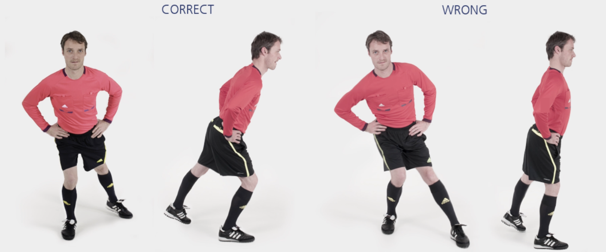

# 主裁 &ndash; 单腿支撑

本练习旨在增强**腿部肌肉协调与平衡**能力。

**起始动作：** 单腿站立，略微弯曲膝盖和臀部，使上半身稍向前倾斜。从正面看，支撑腿一侧的臀部、膝盖和脚应在一条直线上。另一条腿稍稍抬起伸向支撑腿后侧。

**练习动作：** 身体保持平衡，抬起的腿绕支撑腿做**半圆形绕圈**，持续 **30** 秒。然后换另一条腿重复上述练习。

**次数：** 1 组（每侧 30 秒）

**⚠️ 注意事项**

- 从正面看，支撑腿一侧的臀部、膝盖和脚应在一条直线上；
- 支撑腿一侧的髋关节和膝关节略微弯曲；
- 身体重心置于**前脚掌**；
- 上半身面向前方，保持稳定。

>❗️ 切忌膝盖内扣。
>
>❗️ 骨盆保持水平，不可倾斜。

## 🎬 动作示范

    <video controls>
        <source src="../../videos/part2/level1/stance.mp4" type="video/mp4">
    </video>

