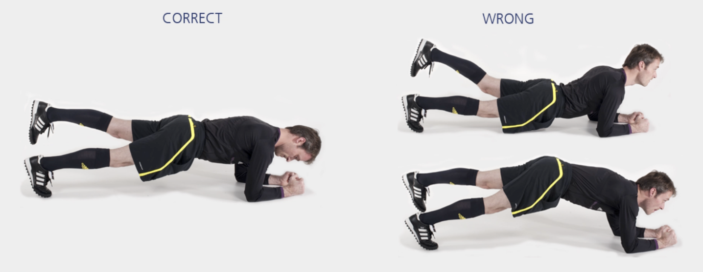

# 俯卧支撑单腿上提

本练习旨在增强**核心**肌群，对保持身体在各类活动中的稳定性至关重要。

**起始动作：** 俯卧，使用前臂和脚支撑身体。

**练习动作：** 提起上半身、骨盆和双腿直至身体成一直线。肩胛骨向脊柱收拢，使背部平直。手肘位于肩膀正下方。收紧腹部和臀部肌肉。抬起一条腿，保持 **20-30** 秒。返回起始动作，短暂休息后，换另一条腿重复上述练习。

**次数：** 1 组（每侧 20-30 秒）

**⚠️ 注意事项**

- 头部、肩部、背部、骨盆成一直线；
- 手肘位于肩膀正下方。

>❌ 头部后仰
>
>❌ 摇晃或拱起背部
>
>✅ 骨盆保持稳定，不可倾斜

## 🎬 动作示范

    <video controls>
        <source src="../../videos/part2/level2/bench.mp4" type="video/mp4">
    </video>

