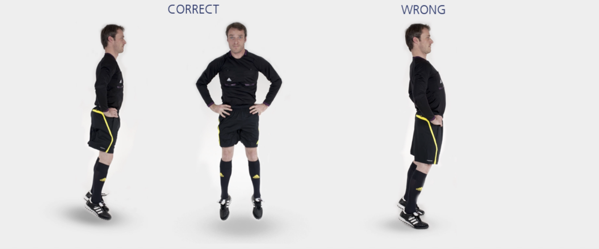

# 小跳

本练习旨在增强**跳跃能力**和**身体控制**。

**起始动作：** 双脚站立，与肩同宽，双手置于腰间。

**练习动作：** 尽可能快地向上跳起。跳起时，伸直整个身体。落地后**不要停下**，立刻再次跳起，持续 **20-30** 秒。

**次数：** 1 组（ 20–30 秒）

**⚠️ 注意事项**

- 从正面看，两侧臀部、膝盖和腿应成两条平行线；
- 跳起时，伸直膝盖，身体挺直；
- 起跳与落地时均**前脚掌**用力；
- 落地时膝盖适当弯曲。

>❗️ 切忌膝盖内扣。

## 🎬 动作示范

    <video controls>
        <source src="../../videos/part2/level2/bouncing.mp4" type="video/mp4">
    </video>

