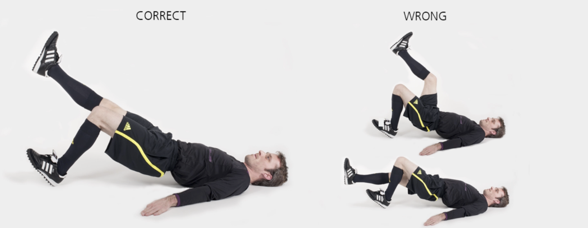

# 臀桥

本练习旨在增强**背部与臀部**肌群，对保持身体在各类活动中的稳定性至关重要。

**起始动作：** 仰卧，膝关节弯曲成90°，双脚平放于地面。

**练习动作：** 一条腿抬起并伸直，骨盆上提至身体成一直线；收紧腹部和臀部肌肉。保持 **1–2** 秒后回到起始动作（一条腿始终抬起）。然后再次提起骨盆、保持、返回，持续 **20–30** 秒。短暂休息后，换一条腿重复上述练习。

**次数：** 1 组（每侧 20–30 秒）

**⚠️ 注意事项**

- 抬起骨盆后，保持身体成一直线；
- 骨盆保持稳定，不可倾斜；
- 支撑脚位于膝盖下方。

>❌ 摇晃或拱起背部

## 🎬 动作示范

    <video controls>
        <source src="../../videos/part2/level2/bridge.mp4" type="video/mp4">
    </video>

