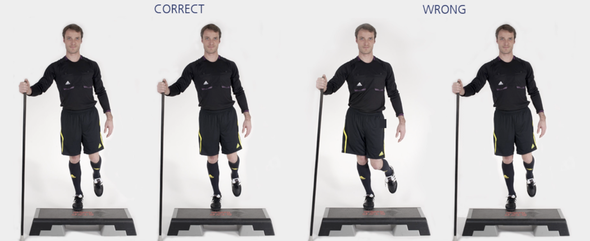

# 小腿肌肉练习

本练习旨在增强**小腿**肌群（和**跟腱**）。

**起始动作：** 单腿站立于木板或箱子的边缘，膝盖伸直。

**练习动作：** 脚尖站立，身体在竖直方向上缓慢上提/降低，降低时脚后跟需**低于**木板或箱子边缘。持续 **20–30** 秒，换另一只脚重复上述练习。裁判员可以使用棍子辅助支撑。

**次数：** 1 组（每只脚 20–30 秒）

**⚠️ 注意事项**

- 保持身体成一直线；
- 从正面看，支撑腿一侧的臀部、膝盖和脚应成一直线。

>❌ 摇晃或拱起背部
>
>❌ 弯曲支撑腿一侧的膝盖
>
>✅ 骨盆保持稳定，不可倾斜

## 🎬 动作示范

    <video controls>
        <source src="../../videos/part2/level2/calf.mp4" type="video/mp4">
    </video>

