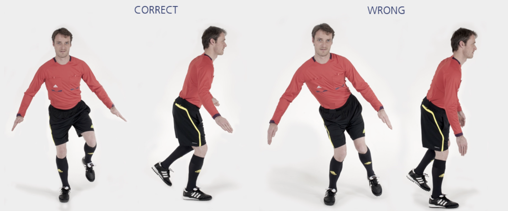

# 主裁 – 十字单腿跳

本练习旨在通过**快速变向**运动锻炼**身体稳定性**。

**起始动作：** 单腿站立，想象地上有一个十字标记，而裁判员站立于十字中央。

**练习动作：** 弯曲支撑腿一侧的髋关节、膝关节和踝关节。保持该姿势，依次向前、向后、向左、向右以及斜向跳跃。使用**爆发力**，尽可能快地跳动。落地时**前脚掌**轻轻着地，同时弯曲髋关节、膝关节和踝关节。练习过程中上身稍向前倾斜。单腿跳 **30** 秒，换另一条腿重复上述练习。

**次数：** 1 组（每侧 30 秒）

**⚠️ 注意事项**

- 从正面看，支撑腿一侧的臀部、膝盖和脚应在一条直线上；
- 起跳与落地时均**前脚掌**用力；
- 落地时弯曲髋关节、膝关节和踝关节；
- 与跳跃高度相比，**起跳力度**和**落地缓冲**更加重要。

>❗️ 切忌膝盖内扣。
>
>❗️ 落地时不要伸直膝盖或用脚后跟着地。

## 🎬 动作示范

    <video controls>
        <source src="../../videos/part2/level2/hops.mp4" type="video/mp4">
    </video>

