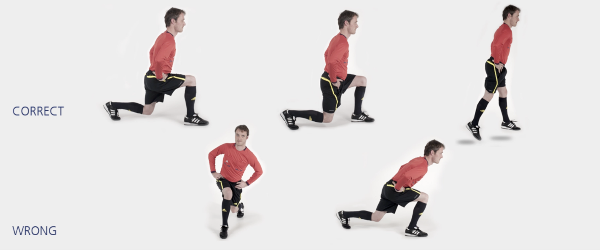

# 主裁 – 弓步跳

本练习旨在增强**跳跃能力**和**身体控制**。

**起始动作：** 前脚站立，另一条腿向后伸直。双手置于腰间。

**练习动作：** 屈膝下蹲成前弓步姿态，然后尽力向上跳起。落地前，**交换前后腿位置**，重复上述练习。持续 **20-30** 秒。

**次数：** 1 组（ 20-30 秒）

**⚠️ 注意事项**

- 挺直上半身；
- 骨盆保持水平；
- 起跳与落地时均**前脚掌**用力。

>❗️ 切忌膝盖内扣。

## 🎬 动作示范

    <video controls>
        <source src="../../videos/part2/level2/scissors.mp4" type="video/mp4">
    </video>

