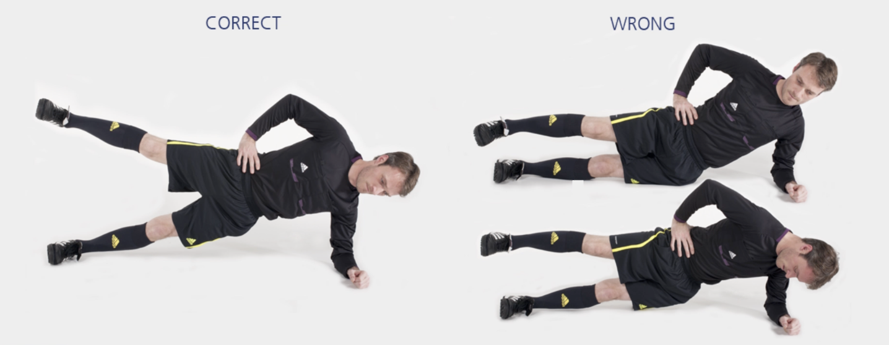

# 侧支撑单腿上提

本练习旨在增强**侧面核心**集群，对保持身体在各类活动中的稳定性至关重要。

**起始动作：** 侧卧，两腿伸直，使用前臂和小腿支撑身体。

**练习动作：** 提起骨盆与双腿，仅下侧脚在地面上保持支撑；身体从上侧肩膀到上侧脚成一直线。抬起上侧腿，然后再缓慢放下。重复 **20–30** 秒。支撑手的手肘应位于肩膀正下方。短暂休息后，换另一侧重复上述练习。

**次数：** 1 组（每侧 20–30 秒）

**⚠️ 注意事项**

- 从正面看，上侧肩膀、臀部和上侧腿应成一直线；
- 从上面看，整个身体应成一直线；
- 支撑手的手肘应位于肩膀正下方。

>❌ 头部倚靠肩膀
>
>❌ 肩膀或骨盆向前后倾斜
>
>✅ 骨盆保持稳定，不可向下倾斜

## 🎬 动作示范

    <video controls>
        <source src="../../videos/part2/level2/sidebench.mp4" type="video/mp4">
    </video>

