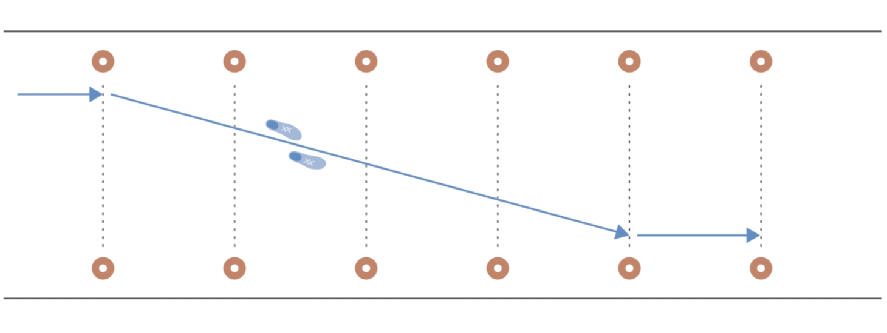
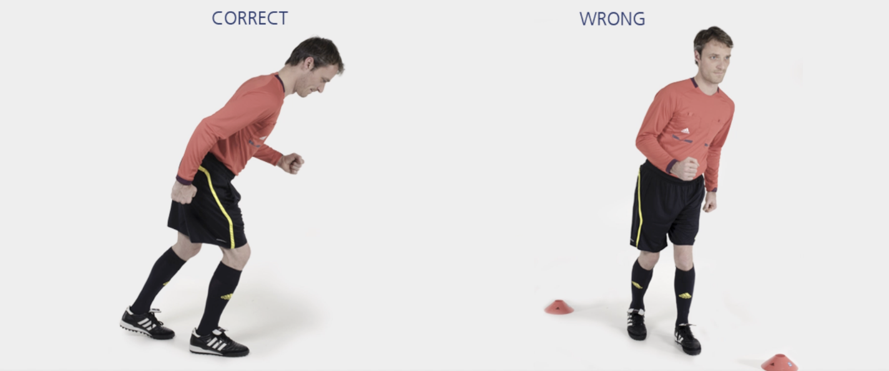

# 长对角线冲刺

在两列标志筒之间完成本练习：

从第一个标志筒出发，**加速跑**至**对侧倒数第二个**标志筒，然后慢跑完剩余路程。沿场地外侧慢速跑回。

**⚠️ 注意事项**

- 上半身保持挺直；
- 臀部、膝盖和脚保持一直线。

>❗️ 切忌膝盖内扣。

## ➿ 跑动路线

## 🎬 动作示范

    <video controls>
        <source src="../videos/part3/lo_diagonal.mp4" type="video/mp4">
    </video>

