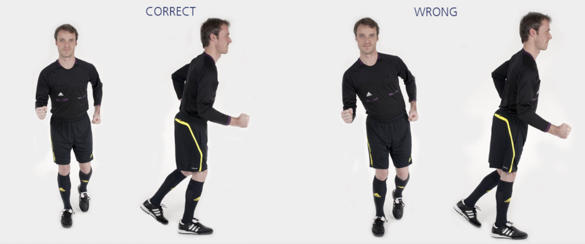

# 渐进跑

从起点出发，逐渐加速跑过最后一个标志筒。沿场地外侧慢跑返回。

✌️ 本练习需完成**两次**。

**⚠️ 注意事项**

- 上半身保持挺直；
- 臀部、膝盖和脚保持一直线。

>❗️ 切忌膝盖内扣。

## 🎬 动作示范

    <video controls>
        <source src="../videos/part3/progression.mp4" type="video/mp4">
    </video>

