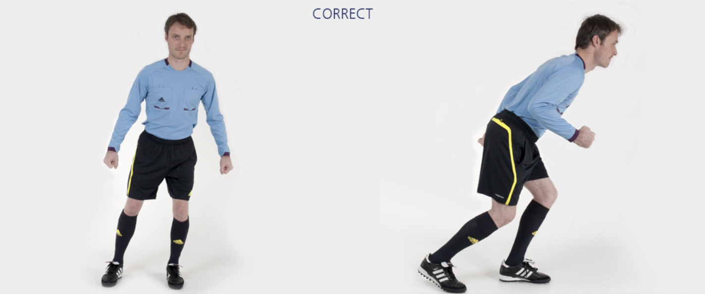

# 主裁 – 侧滑步 + 短距离快速跑

从第一个标志筒出发，**侧滑**至第二个标志筒，**快速跑**至对侧下一个标志筒。重复上述**侧滑步+快速跑**交替练习。最后沿场地外侧慢速跑回。

✌️ 本练习需完成**两次**。

**⚠️ 注意事项**

- 臀部、膝盖略微弯曲，将身体重心置于**前脚掌**；
- 上半身保持挺直。

>❗️ 切忌膝盖内扣。

## 🎬 动作示范

    <video controls>
        <source src="../videos/part3/sh_sprints.mp4" type="video/mp4">
    </video>

