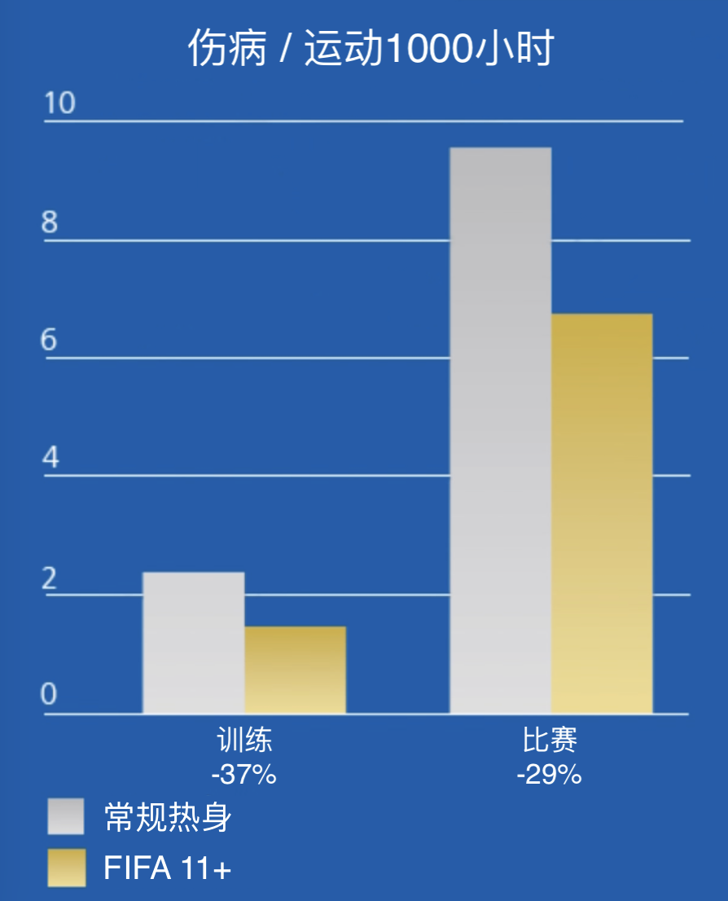
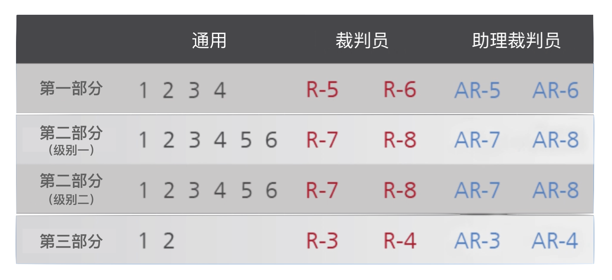
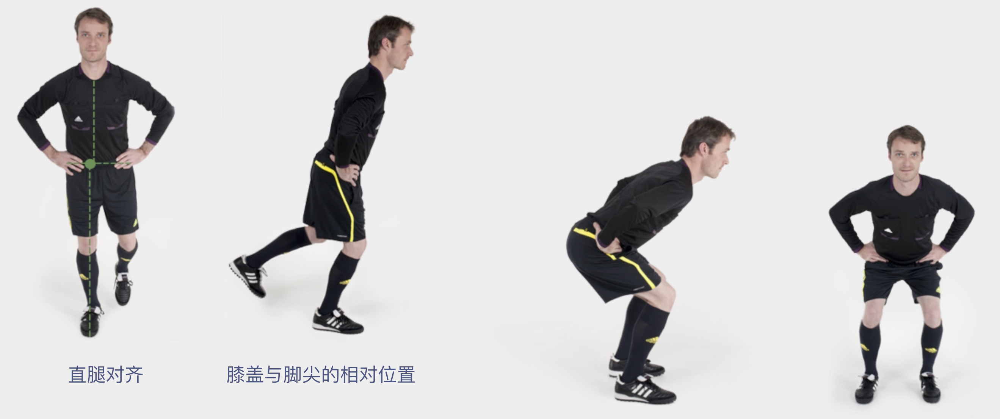
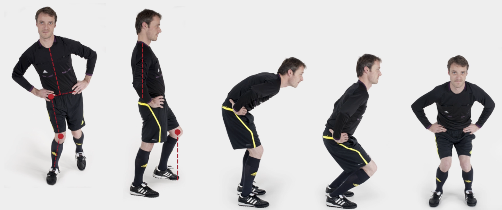
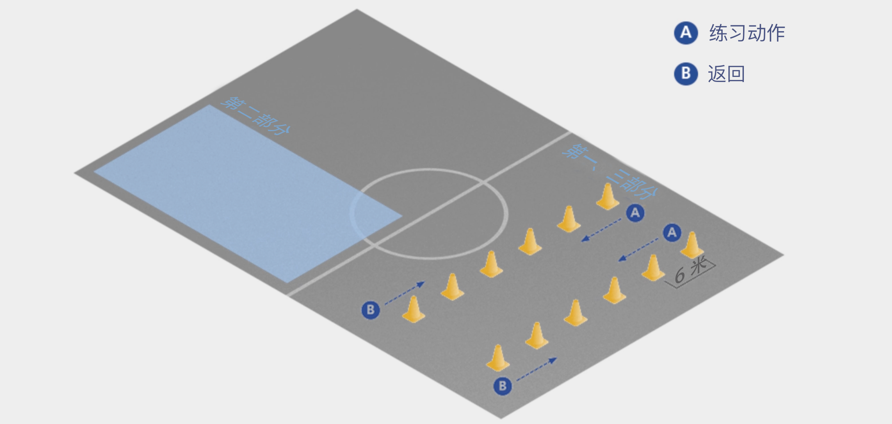

# 手册简介

足球裁判员需要具备多方面的技能，包括耐力、灵活性、速度，以及对比赛技战术的理解。所有这些能力都可以在针对性训练中得以提高。除此以外，执法足球比赛还伴随着受伤的风险，包括创伤性伤害（traumatic injury）和过度使用伤害（overuse injury）。因此，一个理想的训练计划还应当加入伤病预防的练习。

“FIFA&reg; 11+ 裁判员伤病预防项目” 由国际专家组根据 “FIFA&reg; 11+ 伤病预防项目” 以及裁判员特有的伤病情况进行开发，形成一套完整的热身方案，应当取代训练前的常规热身活动。

著名的《英国医学杂志（*British Medical Journal*）》于2008年发布的一项科学研究表明，使用 FIFA 11+ 进行热身的青少年足球队受伤风险明显低于沿用常规热身的球队。每周至少进行两次 FIFA 11+ 练习的球队在训练中的受伤减少37%，比赛中的受伤减少29%；严重受伤减少近50%。

与上届世界杯（2006 & 2007）相比，在最近的世界杯赛场上（2010 & 2011），实施基本的伤病预防项目降低了男女 FIFA 裁判员所遭受的非接触性比赛受伤的发生率。

<figure align="center">
    
</figure>

## 《FIFA 11+（裁判员版）》结构

《FIFA 11+（裁判员版）》分为三个部分，共 18 项练习，应在每次训练开始时按照指定顺序进行。

这些练习侧重于裁判员和助理裁判员的特定活动模式。

<figure align="center">
    
</figure>

**第一部分**：跑动练习

**第二部分**：针对性练习，重点锻炼核心力量、腿部力量、平衡性、力量增强以及灵活性。每项练习都有两个不同难度的动作。

**第三部分**：跑动练习

该训练的关键在于使用正确的技术动作完成所有练习。要充分关注正确的身体姿势和良好的身体控制，如直腿对齐、膝盖与脚尖的相对位置、落地缓冲等。

## 身体姿态

**✅ 正确示范**

**🚫 错误示范**

## 伤病预防的关键要素

对足球裁判员和助理裁判员而言，有效的伤病预防项目的关键要素包括**核心稳定性**、**神经肌肉控制与平衡能力**、**腿后肌群的离心训练**、**力量增强以及灵活性练习**。

### 📌 核心训练

“核心”是一个功能单位，包括躯干肌肉（腹肌、背部伸肌）和盆髋部位的肌肉。保持核心稳定性是充分发挥下肢（尤其是膝盖）能力的关键之一。足球裁判员必须具备足够的髋部和躯干肌肉力量和神经肌肉控制力，以保证核心稳定性。越来越多的科学研究表明，核心稳定性对伤病预防有着重要意义。

### 📌 神经肌肉控制与平衡能力

神经肌肉控制并非一个单一的实体，而是复杂的相互作用体系，涉及不同的肌肉活动（静态动作、动态动作、反应性动作）、肌肉激活（离心收缩多于向心收缩）、多关节肌肉协调、稳定性、身体姿态、平衡能力和预判能力。大量的实证经验和科学研究表明，针对特定运动的神经肌肉训练能够有效预防膝关节和踝关节伤病。

### 📌 力量增强与灵活性练习

“增强式练习”是指让肌肉在尽可能短的时间内达到最大力量的练习。在许多运动技能中，肌肉离心收缩后会迅速发生向心收缩。因此，必须针对运动员所从事的体育项目，使用特定的功能性练习，强调肌肉动作的快速变化，帮助运动员做好准备。增强式练习的目的是缩短肌肉离心收缩和向心收缩的间隔时间。

从生物力学角度看，增强式练习能够正确地训练特定的运动模式，从而增强肌肉、肌腱和韧带的能力。力量增强和灵活性练习是伤病预防项目的重要组成部分，已被证明能够有效预防膝关节和踝关节损伤，特别是前交叉韧带损伤。

## 激励与执行

教练（讲师）应当意识到伤病预防项目的重要性及其训练效果。尽管该项目不能预防所有伤病，但定期的预防性锻炼能够显著减少膝盖损伤、脚踝扭伤、肌肉损伤和过度使用问题。

教练（讲师）应当鼓励裁判员学习《FIFA 11+（裁判员版）》并进行规律、正确的练习。研究表明，准确完成练习动作是保证训练效果的关键。

最简单的方法是将《FIFA 11+（裁判员版）》中的练习作为每次训练开始时的常规热身活动。

另外，如果裁判员没有常规的赛前活动，第一部分和第三部分的跑动练习也可以用作赛前热身。

> **💡 小贴士**
>
> 当然，专业的体能教练（讲师）还可以对练习动作进行调整。

## 如何使用《FIFA 11+（裁判员版）》？

首先，强调伤病预防的重要性，让所有裁判员都深刻认识到这一点，然后再开始讲解和指导具体练习动作。

有效开展此项目活动的关键在于从“级别一”做起，专注于正确完成练习动作；仔细纠正所有错误。良好的身体姿态至关重要，有助于实现更好的神经肌肉控制和训练效果。在裁判员能够正确执行动作之后，可以逐步增加持续时间和重复次数，直至达到项目所建议的强度。

以下步骤有助于指导动作：

1. 简要讲解并演示该动作；
2. 指导裁判员进行练习，并提供整体反馈/纠正；
3. 与所有裁判员讨论出现的问题，并重新演示动作（可邀请一位动作标准的裁判员配合演示）；
4. 指导裁判员再次进行练习，针对个人提供反馈/纠正。

以上方法特别适用于**第二部分**的练习动作。第一部分和第三部分的跑动练习所需的讲解和学习时间应该相对较少。一般来说，裁判员大概需要至少两到三次训练，才能正确完成《FIFA 11+（裁判员版）》（级别一）的所有练习动作。

## 进阶练习

裁判员应当从"级别一"开始练习。在裁判员/助理裁判员能够毫无困难地达到指定的时间和数量标准之后，便可以开始进行“级别二”的练习。

理想情况下，是否开始“级别二”练习应当视每位裁判员的情况单独决定。但在集体训练中，为简单起见，所有裁判员可以在**三到四周**后同时开始“级别二”练习。

> **📌 小贴士**
>
> 对于所有的练习，正确的执行非常重要。因此，教练（讲师）应当对训练加以监督，必要时纠正裁判员的动作。

## 场地设置

训练场地由六对平行的标志筒组成，横向、纵向间距均为 **4 或 6 米**（总长 **20 或 24 米**）。

两名裁判员同时从第一对标志筒出发，沿标志筒**内侧**慢跑，在此途中完成各项练习。经过最后一个标志筒后，沿场地**外侧跑回**；跑回的速度可随着热身的推进逐渐增加。

## 参考文献

1. Bizzini M, Junge A, Bahr R, Helsen W, Dvorak J. Injuries and musculoskeletal complaints in referees and assistant referees selected for the 2006 FIFA World Cup: retrospective and prospective survey. Br J Sports Med. 2009 Jul; 43(7):490-7. Epub 2008 Jul 4.

2. Bizzini M, Junge A, Bahr R, Dvorak J. Female soccer referees selected for the FIFA Women World Cup 2007: survey of injuries and musculoskeletal problems. Br J Sports Med. 2009 Dec; 43(12):936-42. Epub 2008 Oct 16.

3. Soligard T, Myklebust G, Steffen K, Holme I, Silvers H, Bizzini M, Junge A, Dvorak J, Bahr R, Andersen TE. Comprehensive warm-up programme to prevent injuries in young female footballers: cluster randomised controlled trial. BMJ. 2008 Dec 9; 337%:a2469. doi: 10.1136/bmj.a2469.

4. Soligard T, Nilstad A, Steffen K, Myklebust G, Holme I, Dvorak J, et al. Compliance with a comprehensive warm-up programme to prevent injuries in youth football. Br J Sports Med 2010; 44(11):787-793.

5. Castagna C, Abt G, Dttavio S. Physiological aspects of soccer refereeing performance and training. Sports Med. 2007; 37% (7):625-46. Review.

6. Weston M, Castagna C, Impellizzeri FM, Bizzini M, Williams AM, Gregson W. Science and Medicine Applied to Soccer Refereeing: An Update. Sports Med. 2012 Jul 1; 42(7):615-31. doi: 10.2165/11632360-000000000-00000. Review.

7. Bizzini M, Junge A, Dvorak. The FIFA 11+ Manual. FIFA, Zich, 2011.
